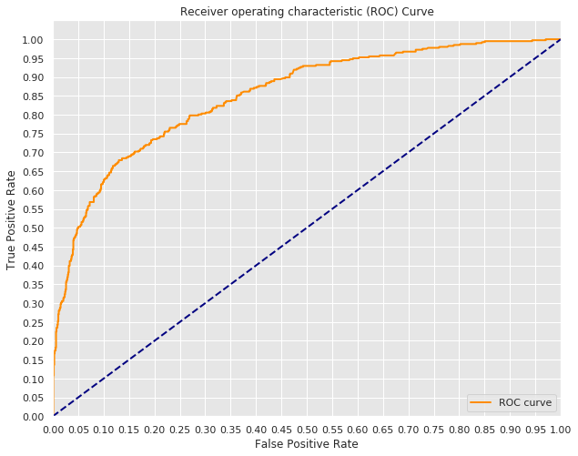
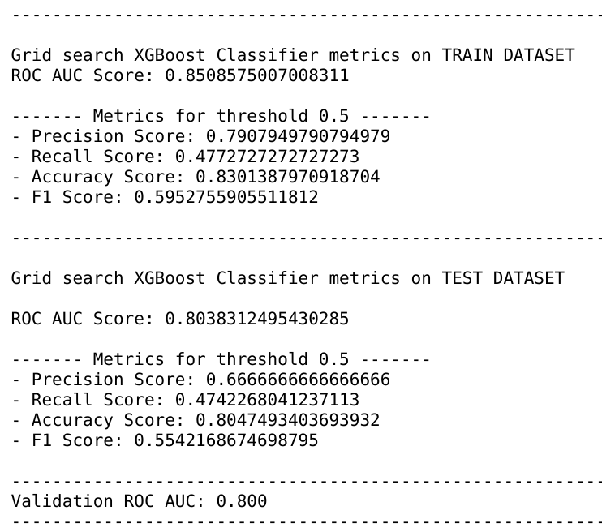
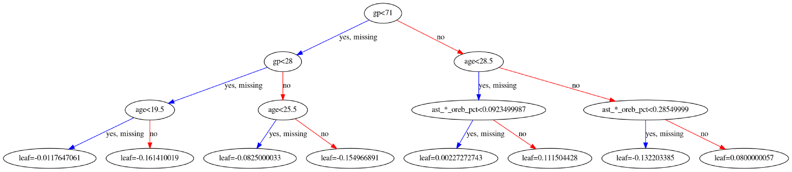
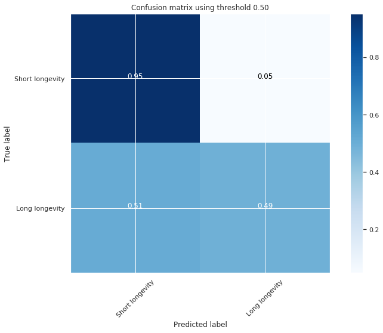

# NBA-Players-Longevity
This project aims to predict NBA player longevity in the league

### Introduction
The goal of this project is predict if a player is likely to stay in the NBA league using his first year statistics (points, rebonds etc...)
- Define the target (how many seasons played can be considered as high longevity in the NBA?)
- Get NBA DATA

### Methodology
The **CRoss-Industry Standard Process for Data Mining - (CRISP-DM)** will be the method I will be using to process the data.

The datasets were collected online from different sources.
The datasets contains each NBA player main statistics for each seasons from the 1996/1997 until the 2016/2017 season.

### Modeling
To build my model and make predictions I followed the following steps:
- Cleaning the data
- Build the target
- Splitting data into train and test sets
- Build a baseline model using Logistic Regression with a 10 folds Cross Validation (using KFold from scikit learn in order to compare the same folds across different models)
- Creating interactions features
- Creating polynomials features
- Building pipelines for the following classifiers
 - K-Nearest Neighbors
 - Random Forests
 - XGBoost
- Then digged deeper using GridSearchCV on our different models
- Chose a threshold independent score (ROC AUC) to chose the best model
- Plot the Confusion Matrix for our corresponding threshold

#### Metrics

Gridsearch XGBoost Roc Curve

Gridsearch XGBoost Metrics

Gridsearch XGBoost Tree

#### Classifying players as high longevity player or low longevity player depending on their statistics
By default the classifier will have a recall of 95% when predicting short longevity when it actually is a short longevity player while having around 15% of players misclassified as short longevity.
We can always adjust the threshold later depending on our needs.

### Conclusions
I can now deploy this model in the following situations:

- When the NBA pre-season starts.
- When the NBA season starts.
- When teams have a lot of injuries and give playing time to players on the end of their bench.

Having this model while extrapolating season stats based on stats/per minutes played can be very useful especially in pre-season where the coaches could use a similar model to chose who they are going to give playing time to.

### Presentation
You can find our slides presentation here => [Slides presentation](https://docs.google.com/presentation/d/1saoXrYQagPYGeDnEOGjZIYsin2HkKCKbeHtU81OheiY/edit#slide=id.g742e3e7cd_1_16)
Or in the pdf **presentation.pdf** in this repository.
